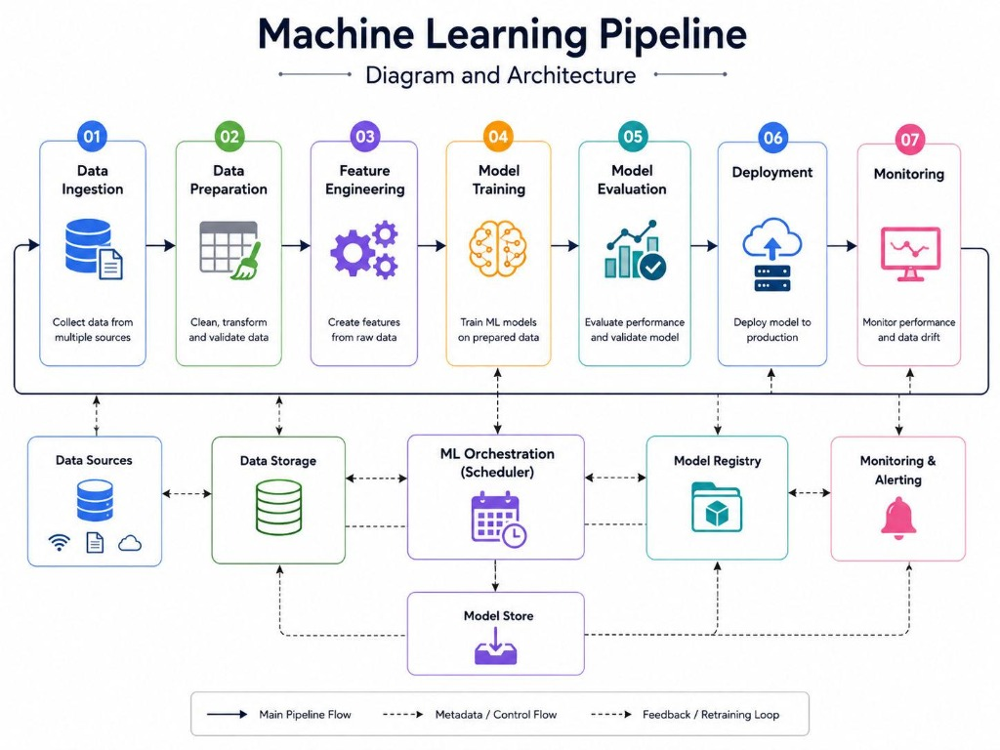
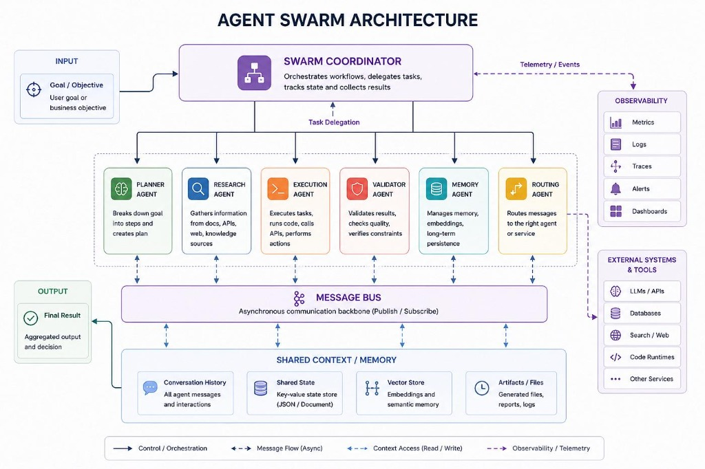
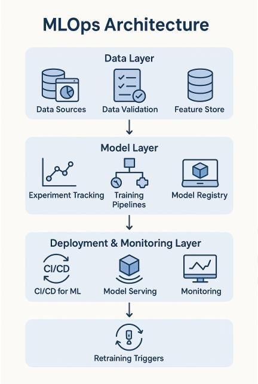
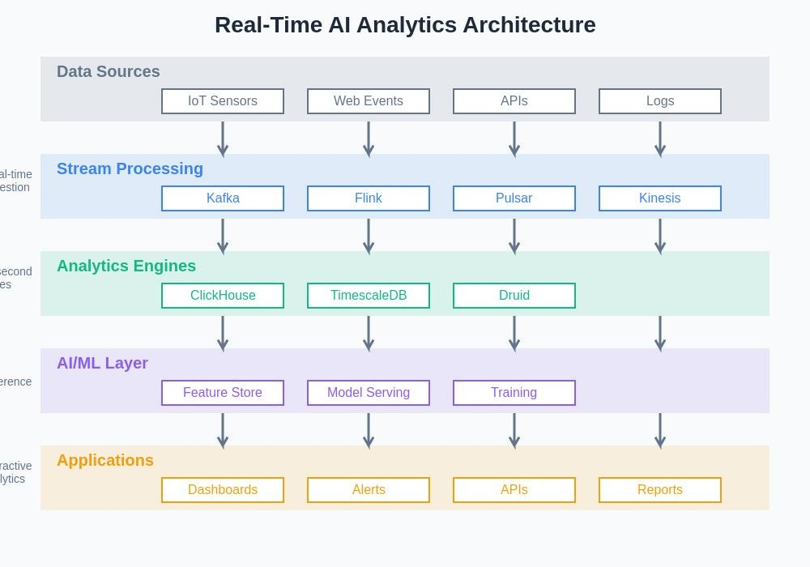
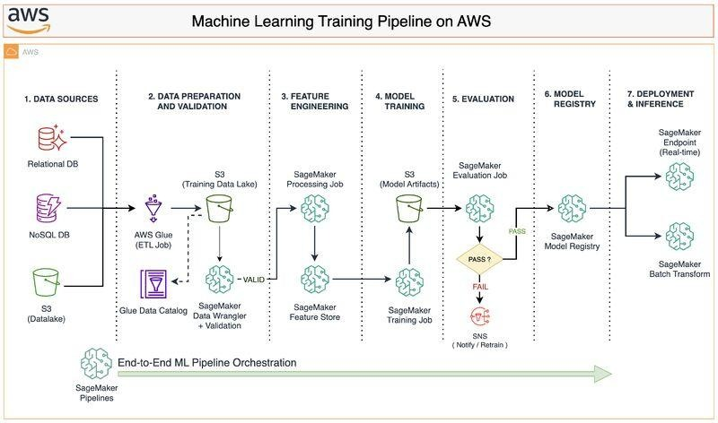

# 🚀 NEXUS — Autonomous Multi-Agent Data Intelligence & Prediction Platform

[](https://www.python.org/downloads/)
[](https://fastapi.tiangolo.com)
[](https://react.dev/)
[](https://www.typescriptlang.org/)
[](https://opensource.org/licenses/MIT)

NEXUS is an end-to-end, production-grade autonomous data intelligence and prediction platform. Acting as an **AI-powered automated data scientist**, NEXUS takes raw datasets (CSV, Excel, JSON, Parquet, streaming feeds) and autonomously executes:

1. **Automated Ingestion & Schema Profiling**: Type inference, missingness mapping, cardinality and outlier analysis.
2. **Data Quality Scoring**: Rigorous, deterministic quality scoring (0-100) based on invalid, outlier, and missing records.
3. **Automated EDA (Exploratory Data Analysis)**: Feature correlations, distributions, skewness, and class imbalance calculations.
4. **AutoML Engine**: Problem classification, model selection (Linear/Logistic, Random Forest, XGBoost, LightGBM, Neural Nets), cross-validation, and multi-metric benchmarking.
5. **Time-Series Forecasting & Anomaly Detection**: Trend decomposition, stationarity testing, prediction intervals, and Isolation Forest anomaly ranking.
6. **Multi-Agent Orchestration**: Graph-based LangGraph DAG orchestrating Data, ML, Forecasting, RAG, and Critic agents.
7. **Critic Verification Layer**: Strict mathematical evidence checking that prevents hallucinated claims.
8. **Decision Intelligence**: Actionable recommendations with quantified risk bounds and confidence intervals.
9. **Interactive Command Center UI**: Modern React + TypeScript interface with dark mode, live agent execution traces, and model comparison labs.

---

## 🏗️ End-to-End Machine Learning Pipeline



The NEXUS pipeline seamlessly connects every phase of the machine learning lifecycle:
* **01. Data Ingestion**: Automated multi-format file ingestion (CSV, Excel, JSON, Parquet, streams).
* **02. Data Preparation**: Automated cleaning, missing value imputation, type coercion, and deterministic quality validation.
* **03. Feature Engineering**: Correlation filtering, scaling, one-hot encoding, and feature importance analysis.
* **04. Model Training**: Multi-algorithm AutoML training across 5-fold cross-validation.
* **05. Model Evaluation**: Comprehensive performance matrix evaluation and model selection.
* **06. Deployment**: Automated model artifact persistence, registry management, and real-time REST inference.
* **07. Monitoring**: Continuous telemetry tracking, PSI/KS data drift detection, and retraining alerts.

---

## 🏛️ System Architecture

```
                               ┌────────────────────────────────┐
                               │   NEXUS Command Center (UI)    │
                               │      React + TypeScript        │
                               └───────────────┬────────────────┘
                                               │ (REST / WebSocket)
                                               ▼
                               ┌────────────────────────────────┐
                               │       API Gateway (FastAPI)    │
                               │   Auth • Jobs • Profiling • ML │
                               └───────────────┬────────────────┘
                                               │
               ┌───────────────────────────────┼───────────────────────────────┐
               ▼                               ▼                               ▼
       ┌───────────────┐               ┌───────────────┐               ┌───────────────┐
       │ Multi-Agent   │               │ Data & AutoML │               │ RAG & Graph   │
       │ Orchestrator  │               │ Engine        │               │ Engine        │
       └───────┬───────┘               └───────┬───────┘               └───────┬───────┘
               │                               │                               │
               └───────────────────────────────┼───────────────────────────────┘
                                               ▼
                               ┌────────────────────────────────┐
                               │       Storage & Persistence    │
                               │  PostgreSQL • Redis • Chroma   │
                               └────────────────────────────────┘
```

---

## 🤖 Multi-Agent Swarm Architecture

NEXUS uses a stateful directed acyclic graph (DAG) swarm built on LangGraph. Autonomous agents collaborate asynchronously through a centralized message bus, sharing context, embeddings, and artifacts with strict validation.



### Agent Roles & Responsibilities

| Agent | Description | Output |
| :--- | :--- | :--- |
| **Swarm Coordinator** | Orchestrates workflows, delegates tasks, tracks DAG state, and aggregates outputs. | Execution Plan & Final Synthesis |
| **Planner Agent** | Decomposes analytical objectives into structured multi-step execution graphs. | Task Execution Graph |
| **Research / RAG Agent** | Gathers domain knowledge and document context with verifiable source citations. | Grounded Evidence Chunks |
| **Execution Agent** | Executes computational workloads (pandas, scikit-learn, statsmodels). | Computed Statistics & Models |
| **Validator (Critic) Agent** | Mathematically audits agent assertions against raw computed data to prevent hallucinations. | Verification Badges & Audit Logs |
| **Memory Agent** | Manages conversation history, key-value state store, and vector embeddings. | Long-term Context & Session Cache |
| **Routing Agent** | Dynamically routes requests, tool invocations, and service dispatches. | Service Invocations |

---

## 🔄 MLOps & Continuous Learning Architecture

NEXUS implements full-lifecycle MLOps governance to maintain reliable models in production:



* **Data Layer**: Robust data ingestion, automated validation checks, and centralized feature store.
* **Model Layer**: Experiment tracking, automated training pipelines, and versioned model registry (Candidate → Staging → Production → Archived).
* **Deployment & Monitoring Layer**: Continuous delivery for ML models, low-latency model serving, and real-time performance telemetry.
* **Retraining Triggers**: Automated drift-triggered retraining via Population Stability Index (PSI) and Kolmogorov-Smirnov (KS) tests.

---

## ⚡ Real-Time Streaming & AI Analytics Architecture

For live operational streaming scenarios, NEXUS provides a high-throughput event processing architecture:



* **Data Sources**: IoT sensors, web events, REST APIs, and application logs.
* **Stream Processing**: High-throughput message ingestion and event stream dispatch (Kafka, Flink, Pulsar, Kinesis).
* **Analytics Engines**: Columnar and time-series analytical storage (ClickHouse, TimescaleDB, Druid).
* **AI/ML Layer**: Feature stores, real-time model serving, and online model training.
* **Applications**: Live telemetry dashboards, instant anomaly alerts, REST endpoints, and automated intelligence dossiers.

---

## ☁️ Enterprise Cloud Deployment Architecture (AWS Reference)

For enterprise scale, NEXUS seamlessly integrates with cloud infrastructure:



* **Data Prep & Cataloging**: AWS Glue ETL and SageMaker Data Wrangler with Glue Data Catalog integration.
* **Feature Management**: S3 Data Lake and SageMaker Feature Store for managed offline/online features.
* **Distributed Training**: SageMaker Training Jobs with S3 model artifact persistence.
* **Evaluation Gate**: Automated evaluation jobs with Pass/Fail validation criteria and SNS alerting.
* **Deployment Options**: Real-time SageMaker Endpoints and SageMaker Batch Transform pipelines orchestrated via SageMaker Pipelines.

---

## ⚡ Quick Start

### Prerequisites
* Python 3.11+
* Node.js 18+ and npm 9+
* Docker & Docker Compose (Optional for full containerization)

### Local Development Setup

1. **Clone & Setup Backend**:
   ```bash
   git clone https://github.com/sujaykarumbar/nexus.git
   cd nexus
   python -m venv venv
   # Windows:
   .\venv\Scripts\activate
   # Linux/macOS:
   source venv/bin/activate

   pip install -r requirements.txt
   ```

2. **Run Backend API**:
   ```bash
   uvicorn apps.api.main:app --reload --host 127.0.0.1 --port 8000
   ```
   * Interactive OpenAPI Docs: `http://localhost:8000/docs`
   * Health Check: `http://localhost:8000/api/v1/health`

3. **Run Frontend Application**:
   ```bash
   cd apps/web
   npm install
   npm run dev
   ```
   * Access the UI at: `http://localhost:5173`

4. **Run with Docker Compose**:
   ```bash
   docker-compose up --build
   ```

---

## 🧪 Testing

Run backend tests with pytest:
```bash
pytest tests/backend -v
```

---

## 🗺️ Engineering Roadmap — 100% Completed
- [x] **Phase 1**: Architecture, Monorepo, FastAPI backend, JWT Auth, Database models, React Command Center UI, Docker setup.
- [x] **Phase 2**: Dataset Ingestion, Validation, Profiling & Automated EDA Engine.
- [x] **Phase 3**: AutoML Engine, Bayesian Hyperparameter Tuning & Model Comparison.
- [x] **Phase 4**: Time-Series Forecasting, Anomaly Detection & SHAP Explainability.
- [x] **Phase 5**: LangGraph Multi-Agent Swarm with Strict Critic Verification.
- [x] **Phase 6**: Document Intelligence & Production RAG with Evidence Citations.
- [x] **Phase 7**: Knowledge Graph Extraction & GraphRAG (Neo4j).
- [x] **Phase 8**: Real-Time Streaming, Async Event Bus & Anomaly Detection Simulator.
- [x] **Phase 9**: MLOps Engine, Model Version Registry, Data Drift (PSI/KS) & Pipeline Scheduler.
- [x] **Phase 10**: Deep Health Observability, Executive Intelligence Dossiers & Production Hardening.
